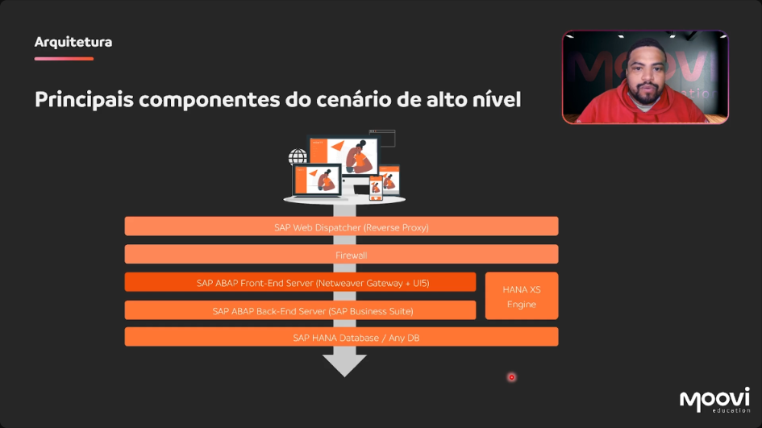
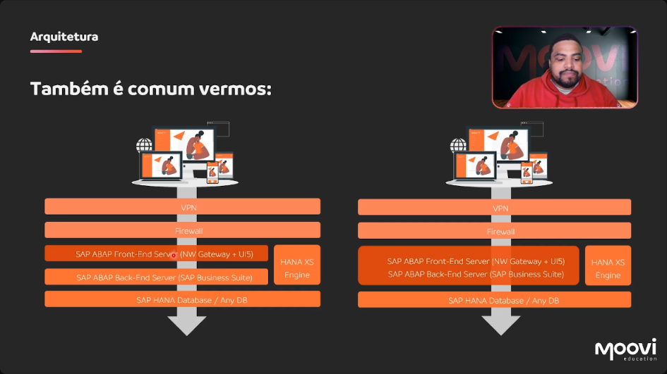

[00:00:31](https://moovi.curseduca.pro/m/lessons/fiori-freestyle-1734443760098)
### 🏛️ SAP Fiori Architecture (High-Level Overview)
- Composed of several components in a high-level scenario.  

---

### 🌐 **SAP Web Dispatcher (Reverse Proxy)**
- Handles incoming requests from the internet.  
- Acts as a reverse proxy.  
- Receives requests and communicates with the internal server.  
- Requests from the internet pass through it.  
- Requests are directed to the address where the web dispatcher is published.  

---

### 🛡️ **Firewall**
- After the Web Dispatcher, requests pass through the firewall.  

---

### 💻 **SAP ABAP Front-End Server (Netweaver Gateway + UI5)**
- Receives requests via HTTP.  
- Where Netweaver Gateway and SAP UI5 libraries are installed.  
- Gateway module will be discussed in more detail later; apps will be built using the gateway.  

---

### 🏢 **SAP ABAP Back-End Server (SAP Business Suite)**
- Hosts the instance of S/4HANA or ECC.  
- The ABAP environment is connected to a database:  
    - Can be a HANA database.  
    - Can be any other relational database.  

---

### 🧩 **HANA XS Engine**
- A layer of HANA providing services for application creation.  
- Applications can run based on Java and Node.js.  
- Has a dedicated database and a separate server for HANA XS services.  
- Used to publish applications similar to cloud applications.  

---

### ⚙️ **Architecture Notes**
- The configuration is based on a compliance scenario where S/4HANA is installed on a server in the gateway environment.  
- Consultation and service consumption are done via HTTP.  
- This scenario does not involve a HANA XS installation.  
- In some Fiori application architectures, the web dispatcher layer may be absent.  
- If a Fiori app is accessed only on the local network, end-users need a VPN to reach the internal network.  
    - The VPN then communicates with Fiori.  

---

### 🔗 **Common Deployment Scenarios**
- Separate front-end and back-end servers.  
- Integration using HANA XS.  
- Single installation of front-end server and Business Suite on one machine:  
    - Gateway and ERP environment on a single server.  
    - In contrast to dedicated servers for gateway and ERP.  
    - Choice depends on security, budget, etc.  
    - Separating is recommended, with a dedicated server for the gateway.  
- Common setup includes separate servers.  
- This setup protects data and ensures that servers receive exclusive calls from the internet or intranet.  

---

### 📸 Screenshot Reference
  
[Video Timestamp: 00:03:38](https://moovi.curseduca.pro/m/lessons/fiori-freestyle-1734443760098)
