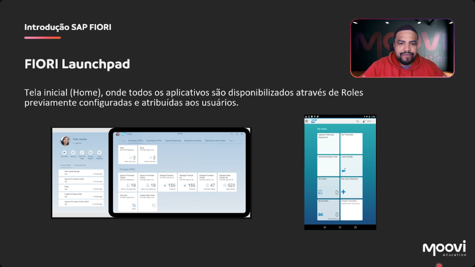

[00:00:54](https://moovi.curseduca.pro/m/lessons/fiori-freestyle-1734443760098)
### Introdução ao SAP Fiori
- **Fiori Launchpad**: Tela inicial (Home) onde todos os aplicativos são disponibilizados através de *Roles* previamente configuradas e atribuídas aos usuários.
- É o ponto de partida para acessar os aplicativos Fiori.
- Na página inicial, temos informações importantes, como os grupos e *roles* atribuídos ao usuário.
- No primeiro acesso, os aplicativos exibidos são aqueles previamente configurados e atribuídos.
### Características do Fiori Launchpad
- **Personalizável por usuário ou grupo**: Cada usuário pode ter um grupo de aplicativos próprio e personalizável.
    - Exemplo: Criar um grupo com 10 aplicativos usados diariamente para acesso rápido, como um "link de favoritos".
- **Apps disponíveis em "Tiles"**: Os "tiles" são os quadradinhos que vemos ao acessar o Fiori.
### Características Adicionais dos Tiles no Fiori Launchpad
- Os *tiles* podem exibir **informações gráficas** ou contagens de itens pendentes.
    - Exemplo: Mostrar o número de itens na caixa de entrada.
    - Permite uma visualização rápida dos itens pendentes sem precisar entrar no aplicativo.
- Os *tiles* são **dinâmicos**.
    - Ao clicar em um *tile*, o usuário é direcionado para o aplicativo correspondente.
    - Exemplo: Clicar no *tile* "My Inbox" leva à tela padrão do aplicativo, mostrando as tarefas pendentes.
### Formas de Acesso ao Fiori Launchpad
- **Diretamente via URL**: Acesso através do navegador.
    - Padrão da URL: `https://<domínio>:<porta>/sap/bc/ui2/flp?sap-client=<client>&sap-language=PT`
        - `<domínio>`: Domínio do servidor SAP.
        - `<porta>`: Porta de comunicação.
        - `/sap/bc/ui2/flp`: Caminho padrão para o Fiori Launchpad.
        - `sap-client`: Especifica o *client* (mandante) SAP.
        - `sap-language=PT`: Define o idioma como Português.
- **Via Transação**: Usando o código de transação no SAP GUI.
    - `/N/UI2/FLP`
- Acesso ao Fiori Launchpad pode ser feito através da URL, que inclui informações como domínio, porta, client e idioma.
- Exemplo de URL: `https://<domínio>:<porta>/sap/bc/ui2/flp?sap-client=<client>&sap-language=PT`
- Acesso via transação no SAP GUI: `/N/UI2/FLP`.
- Se estiver logado no SAP GUI, pode acessar o Fiori Launchpad através dessa transação.
- Para acessar em celular ou tablet, utilize a URL.
- O celular ou tablet deve estar conectado na mesma rede onde o servidor Fiori está, ou se o servidor estiver publicado na internet.
- **Acesso via Transação**: Demonstração de acesso ao Fiori Launchpad através da transação `/N/UI2/FLP` no SAP GUI.
- Ao executar a transação, o SAP GUI abre uma janela solicitando permissão para abrir o navegador.
- Após permitir, é exibida a tela de *login* padrão do Fiori.
- O usuário pode inserir as mesmas credenciais utilizadas no SAP GUI para acessar o Fiori.
- É possível selecionar o idioma e o mandante (ex: 100) para acessar os dados desejados.
### Aplicações no Fiori Launchpad
- Na página inicial do Fiori Launchpad, os aplicativos são exibidos.
- Os aplicativos exibidos são aqueles que estão disponíveis e foram publicados, e que o usuário tem acesso através das *roles* atribuídas.
- As *roles* dos aplicativos aparecem logo na tela inicial.
- Cada *role* específica tem seus aplicativos publicados.
- É possível configurar, através de *roles*, quais grupos de aplicativos um usuário terá acesso.
    - Exemplo: Um usuário de logística pode ter acesso somente a três grupos e aos aplicativos que ele precisa acessar no dia a dia.
    - Isso facilita o acesso e evita que o usuário precise acessar todos os aplicativos disponíveis.
### Aplicações e *Tiles* no Fiori Launchpad
- Dentro de cada grupo de aplicativos, existem os *tiles*. É possível pesquisar os *tiles* através do menu ou do menu lateral.
- Ao acessar "Administrar dados mestre de produtos", o aplicativo carrega a tela inicial, que geralmente segue um padrão.
- Na primeira tela, há um relatório que permite filtrar informações para realizar buscas rápidas nos dados.
- É possível clicar em "Iniciar" para ver todos os materiais cadastrados.
### Detalhes do Aplicativo de Produto
- Dentro do aplicativo, há várias abas para visualizar informações detalhadas de um produto específico.
- **Exemplos de abas disponíveis**:
    - `Informações gerais`
    - `Conformidade do produto`
    - `Componentes`
    - `Classificação`
    - `Configuração`
    - `Vendas`
    - `Depósito`
    - `Administração de depósitos`
    - `Planejamento ampliado de peças de reposição`
    - `Cadeias de distribuição`
    - `Centros`
    - `Áreas de avaliação`
    - `Texts`
    - `Anexos - Document Management Services`
    - `Anexos - Serviços de objeto genéricos`
- É possível acessar todos os textos, anexos e outras informações relacionadas ao produto diretamente nessas abas.