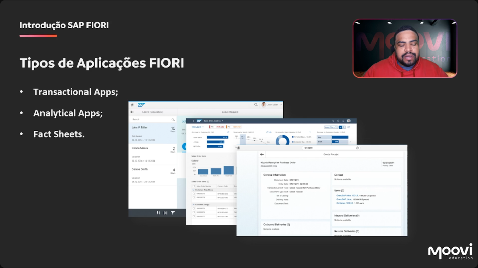

[00:00:20](https://moovi.curseduca.pro/m/lessons/fiori-freestyle-1734443760098)
### 📱 Types of Fiori Applications
- Fiori apps are classified into three main types:  
    - 📝 **Transactional Apps**  
    - 📊 **Analytical Apps**  
    - 📄 **Fact Sheets**  

---

### 📝 Transactional Apps
- Enable you to perform transactional tasks, such as:  
    - Creating SAP sales orders  
    - Inventory control  
    - Product registration, and more  
- These are the standard applications; most apps we develop fall under this category.  

---

### 📊 Analytical Apps
- Provide **real-time information** based on business operations.  
- Display dashboards, e.g., a company's balance sheet for a specific year.  
- Offer **data visualization** to support decision-making in a business context.  

---

### 📄 Fact Sheets
- Applications that usually provide **links to related information**.  
- Used to detail **key data and contextual information** in business operations.  
- Offer links to related data, such as:  
    - Direct registration of a client  
    - A supplier  
    - Other application-specific data  
- All this contextual information is a characteristic of Fiori Fact Sheet apps.
