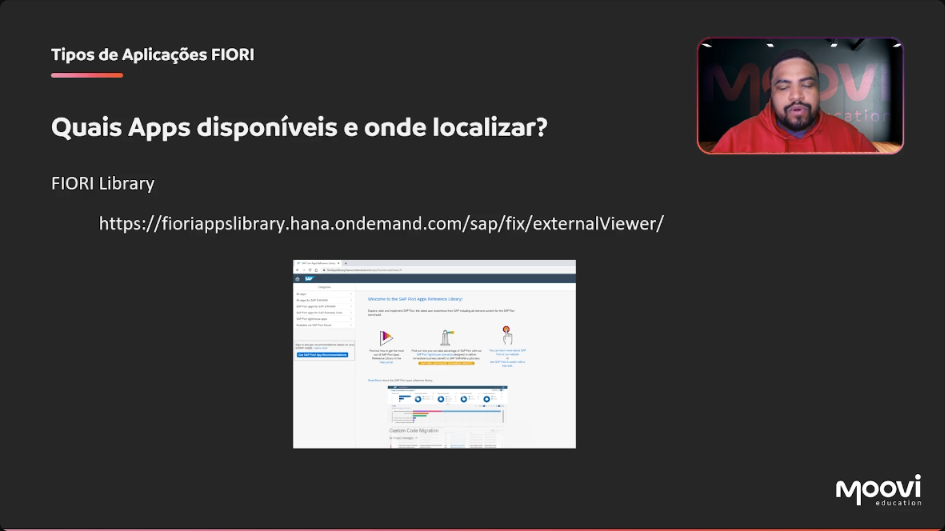

[00:00:32](https://moovi.curseduca.pro/m/lessons/fiori-freestyle-1734443760098)
### 📱 Fiori Apps
- SAP provides a **Fiori Apps Library** accessible at:  
  🔗 `fioriappslibrary.hana.ondemand.com/sap/fix/externalViewer/`
- Contains all **standard apps** developed by SAP.  
- Fiori is constantly evolving, with new apps created over the years.  
- All standard apps available in HANA versions are listed here.  

---

### 📚 SAP Fiori Apps Library
- 🌐 **URL**: [Fiori Apps Library](https://fioriappslibrary.hana.ondemand.com/sap/fix/externalViewer/)  
- Provides a **guide to navigate and explore available apps**.  
- 🔍 Search options:  
  - All Apps  
  - Apps for **S/4HANA**  
  - Apps for **Business Suite**  
  - Lighthouse Apps  
  - Fiori Cloud  
- Currently lists **~15,158 apps** (number constantly updated).  
- Search by **app name** or **keywords**.  
- Filtering options:  
  - By product suite (e.g., SAP Business Suite, SAP S/4HANA Cloud)  
  - By application type (transactional, analytical, fact sheet)  

💡 Examples:  
- Searching for **VA01** shows related Fiori apps such as *Manage Sales Orders*.  
- Some apps run only on **SAP HANA database**.  
- Classic transactions can still run via **SAP GUI for HTML inside Fiori**.  

📌 Installation details:  
- Front-End Components:  
  - Product Version (e.g., *SAP Fiori for S/4HANA 2022*)  
  - Support Package Stack  
  - Software Component Version  
  - Add-On prerequisites  
- Back-End Components (ABAP):  
  - Product Version (e.g., *SAP S/4HANA 2021*)  
  - Support Package Stack  
  - Software Component Version  

---

### 📂 Technical Catalogs
- Example: `SAP_TC_CEC_SD_COMMON`  
- Helps check if a user has the **necessary roles assigned**.  
- If missing, Basis team needs to assign the appropriate roles.  

---

### 🔧 Extensibility
- Defines types of **possible extensions** for Fiori applications.  
- Possible to **modify views, services, or add fields**.  
- Modern extensibility is **less invasive** compared to classic versions.  
- Similar to **ABAP enhancement points** in standard applications.  
- Shows:  
  - Related notes (backend and frontend)  
  - Related applications  
