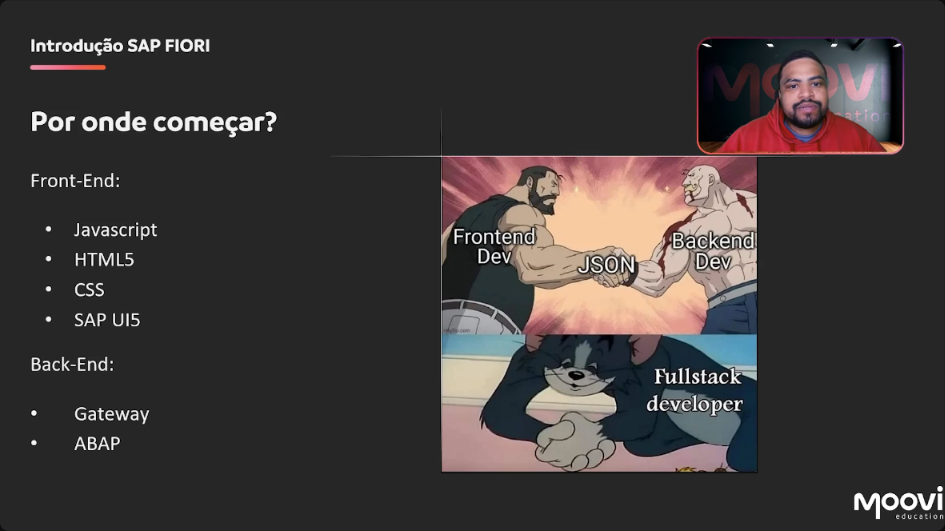

[00:02:05](https://moovi.curseduca.pro/m/lessons/fiori-freestyle-1734443760098)
## 🚀 Introduction to SAP Fiori: Where to Start?
- In previous modules, we covered concepts like:  
  - 📌 Locating **standard applications**  
  - 📌 What **Fiori** is  
  - 📌 What the **Fiori Launchpad** is  

---

### 🛠️ Beginning Custom Fiori Application Development
If you want to start building **custom Fiori applications**, here’s the roadmap:  

#### 🎨 Front-End Development
- **Languages & Technologies**:  
  - 💻 `JavaScript`  
  - 🌐 `HTML5`  
  - 🎨 `CSS`  
  - 📚 `SAP UI5` (library of controls used in Fiori apps, e.g., tables, filters, buttons)  

#### ⚙️ Back-End Development
- **Technologies**:  
  - 🔌 `Gateway` → NetWeaver Gateway is where **OData services** are published & consumed by Fiori apps.  
  - 👨‍💻 `ABAP` → Required in **S/4HANA** or ABAP back-end environments.  
  - 📚 `SAP UI5` → UI library also interacts with backend services.  

💡 Note:  
- **CSS** is specifically for styling & layout of web applications.  
- **SAP UI5** bridges **front-end controls** with **back-end OData services**.  
