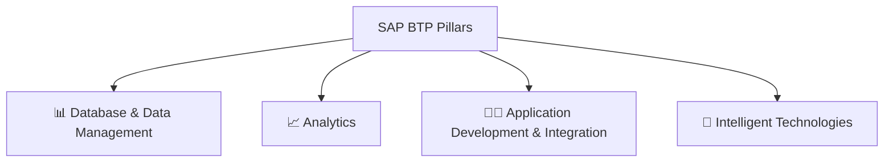

Of course! Here are detailed, easy-to-understand notes for your class on SAP BTP, created in rich markdown format with icons to enhance your English study.

***

# 🚀 Introduction to SAP BTP (Business Technology Platform)

### **📌 Key Takeaway**
SAP BTP is SAP's **cloud platform service**, a collection of various services and tools designed to empower "intelligent enterprises."

---

## 1. 📜 What is SAP BTP?

*   **🧠 Acronym:** **B**usiness **T**echnology **P**latform.
*   **☁️ Definition:** It is a **Cloud Platform** from SAP.
*   **🧩 Composition:** It is built from a wide range of services, applications, and tools.
*   **🎯 Purpose:** To empower and boost "intelligent enterprises" in various scenarios.

---

## 2. 🕰️ The Evolution & History of SAP BTP

The platform has evolved significantly over the years:

| Year | Platform Name | Key Characteristics |
| :--- | :--- | :--- |
| **🏁 2012** | **SAP NetWeaver Cloud** | The beginning of SAP's cloud journey. Provided cloud applications and some infrastructure resources (e.g., servers). |
| **🚀 2013** | **SAP HANA Cloud Platform (HCP)** | The start of a portfolio of cloud services from SAP. Focused on HANA in the cloud. |
| **🔄 2017** | **SAP Cloud Platform (SCP)** | The platform was renamed as it expanded to include many more functionalities beyond just HANA. |
| **🎯 2021** | **SAP Business Technology Platform (BTP)** | The current, comprehensive platform with a vast array of cloud services for integration, database, analytics, and more. |

---

## 3. 🏛️ The Four Main Pillars of SAP BTP

SAP BTP's services are organized into four key pillars:

### **📊 Database & Data Management**
*   **Focus:** Managing and processing data.
*   **🔧 Key Services:**
    *   **SAP HANA Cloud:** High-performance in-memory database.
    *   **Data Intelligence:** For managing data orchestration and pipelines.

### **📈 Analytics**
*   **Focus:** Turning data into insights and reports.
*   **🔧 Key Services:**
    *   **SAP Analytics Cloud (SAC):** A comprehensive analytics solution.
    *   **SAP BW/4HANA:** Data warehousing.

### **👨‍💻 Application Development & Integration**
*   **Focus:** Building new applications and connecting systems.
*   **🔧 Key Services:**
    *   **Business Application Studio:** The main web-based IDE (development environment).
    *   **Integration Suite (CPI):** For connecting different applications and processes.
    *   **Extension Suite:** For customizing and extending SAP solutions.

### **🤖 Intelligent Technologies**
*   **Focus:** Adding AI and automation to business processes.
*   **🔧 Key Services:**
    *   **SAP Intelligent RPA (Robotic Process Automation):** For automating repetitive tasks.
    *   **Conversation AI:** For building chatbots.
    *   **Internet of Things (IoT):** For connecting and managing IoT devices.

---

## 4. ☁️ SAP BTP in the Cloud Service Model

### **🏗️ The Cloud Service Stack**

SAP BTP operates as a **Platform as a Service (PaaS)**.

| Layer | What it is | Example |
| :--- | :--- | :--- |
| **🟦 SaaS** (Software as a Service) | **Ready-to-use software** delivered over the cloud. | **Gmail** - You just use the application. |
| **🟩 PaaS** (Platform as a Service) | **A platform** providing tools and environment to **build, integrate, and deploy** applications. | **SAP BTP** - This is where it lives! |
| **🟥 IaaS** (Infrastructure as a Service) | **Fundamental computing resources** (servers, storage, networking). | **AWS, Microsoft Azure, Google Cloud** - BTP can run on these. |

*   **💡 Important Note:** BTP is **not exactly the same** as hyperscalers like AWS or Azure. It is a **PaaS** that can actually **run on top** of their IaaS infrastructure.

---

## 5. 🧪 How to Get Started with SAP BTP

*   **🎉 Free Tier:** SAP provides a **free Trial Account** for the BTP.
*   **✅ What you need:** Just an email address to sign up.
*   **🎯 What you can do:**
    *   Explore services.
    *   Follow development tutorials.
    *   Build and test your own applications.
    *   Activate and use the **Business Application Studio** (the development environment used in this course).

---

### **📝 Summary & Next Steps**

*   SAP BTP is the central platform for innovation and extension in the SAP world.
*   It combines **Data, Analytics, Development, Integration, and AI** into one unified environment.
*   You can start learning immediately with the **free trial account**.

**Next Lesson:** We will set up your BTP Trial Account and activate the Business Application Studio!