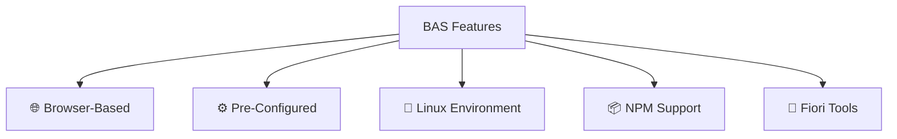

# 💻 SAP Business Application Studio (BAS) - Complete Guide

### **📌 Lesson Overview**
SAP Business Application Studio (BAS) is the modern, cloud-based development environment for building SAP Fiori applications and more on the BTP platform.

---

## 1. 🎯 What is Business Application Studio?

### **🔧 Definition & Purpose**
*   **☁️ Cloud-Based IDE:** A development environment provided **as a service** on SAP BTP
*   **🌐 No Local Installation:** Runs entirely in your **web browser**
*   **🎯 Primary Use:** Development of **SAP Fiori applications**

### **⚡ Key Characteristics**
*   **🆓 Included in BTP Trial:** Available through subscription in your trial account
*   **🚫 No Local Tools Needed:** No need for Visual Studio Code or Eclipse
*   **💻 Remote Processing:** All processing happens on SAP's Linux virtual machines
*   **🔧 Pre-Configured:** Comes with all necessary tools and plugins pre-installed

---

## 2. 🆚 BAS vs Traditional Development

### **🔄 Comparison Table**

| Aspect | Traditional Development | Business Application Studio |
|--------|------------------------|----------------------------|
| **📍 Location** | Local machine | Cloud-based (Browser) |
| **🛠️ Setup** | Manual installation & configuration | Pre-configured & ready-to-use |
| **💾 Hardware** | Depends on your local machine | SAP-managed Linux containers |
| **🔌 Requirements** | Specific OS, plugins, packages | Only internet connection |
| **🔄 Consistency** | Varies by developer | Standardized environment |

---

## 3. 🎨 User Interface & Experience

### **👀 Visual Appearance**
*   **🎨 Familiar Interface:** Heavily resembles **Visual Studio Code**
*   **⚙️ Based On:** Built on **Eclipse Theia** platform
*   **💡 Easy Transition:** Developers familiar with VS Code will feel right at home

### **🖥️ Key Features**

---

## 4. 🚀 Technical Capabilities

### **🛠️ Development Environment**
*   **🐧 Linux Containers:** Runs on standardized Linux environments
*   **📦 NPM Commands:** Full support for Node.js package management
*   **🔗 Production Parity:** Matches production environment architecture
*   **⚡ Performance:** Hardware resources managed by SAP

### **✅ Advantages**
*   **🌍 Platform Independent:** Works on Windows, Mac, or Linux
*   **💪 No Hardware Limits:** Don't need a "NASA-level" computer
*   **🔄 Team Consistency:** All developers use identical environments
*   **🚀 Quick Start:** Jump straight into coding without setup

---

## 5. 📜 Evolution from Previous Tools

### **🕰️ Historical Context**
*   **⏮️ Previous Tools:**
    *   **Eclipse** with SAP plugins
    *   **SAP Web IDE** (web-based)
*   **🔄 Current Standard:** **Business Application Studio** is the **recommended tool**
*   **📉 Legacy Status:** SAP Web IDE is being **phased out**

### **🎯 Why BAS?**
*   **💪 More Powerful** than previous options
*   **🆕 Modern Templates** generated specifically for BAS
*   **🔮 Future-Proof** SAP's strategic development platform

---

## 6. 🎯 Getting Started

### **📋 Prerequisites**
*   ✅ Active **BTP Trial Account**
*   ✅ **Internet Connection**
*   ✅ **Business Application Studio** subscription enabled

### **🚀 Next Steps**
*   In the next lesson, we'll **configure BAS** in your BTP trial account
*   Get ready to start **developing Fiori applications**!

---

## 7. ✅ Key Takeaways

### **🌟 Summary**
*   BAS = **Cloud-based development environment**
*   **No local installation** required
*   **Pre-configured** for SAP Fiori development
*   **Runs in browser** on SAP-managed infrastructure
*   **Modern replacement** for Web IDE and Eclipse

### **🎉 Ready for Development**
With Business Application Studio, you can focus on **coding** rather than environment setup and configuration!

---

**Next Lesson:** We'll configure Business Application Studio in your BTP trial account and create your first development space! 🚀