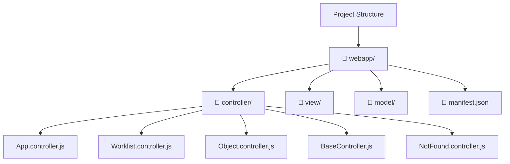

# 🚀 Creating Your First SAP Fiori App: Hello World Tutorial

### **📌 Project Overview**
Build a functional SAP Fiori Worklist Application using templates in Business Application Studio without writing code.

---

## 1. 🏗️ Project Setup & Template Selection

### **📋 Starting a New Project**
1.  **📍 Navigation:** Open **Business Application Studio**
2.  **🆕 New Project:** Click **"Start from Template"**
3.  **🎯 Template Type:** Select **"SAP Fiori Application"**

### **🔧 Application Configuration**
| Step | Selection | Purpose |
|------|-----------|---------|
| **Application Type** | `Freestyle` | Custom Fiori development |
| **Template** | **`SAP Fiori Work List Application`** | List-detail pattern |
| **Data Source** | `OData Service` | Connect to backend service |

---

## 2. 🔗 Data Source Configuration

### **🌐 Connecting to OData Service**
1.  **🔗 Service URL:** Paste your Gateway service URL
    *   Format: `http://server:port/sap/opu/odata/sap/Z_SERVICE_NAME_SRV`
2.  **🔐 Authentication:**
    *   **Username:** Your S/4HANA system user
    *   **Password:** Your system password
3.  **✅ Test Connection:** Click **login button** to validate

### **📊 Entity Selection**
*   **📋 Choose Entity:** Select **SCARR** (Airlines entity)
*   **🔑 Key Field:** `Carrid` (Airline ID)
*   **🏷️ Display Field:** `Carname` (Airline Name) - This will show in the list

---

## 3. ⚙️ Project Configuration

### **📝 Basic Project Settings**
| Setting | Value | Description |
|---------|-------|-------------|
| **Project Name** | `HelloWorld` | Your project identifier |
| **Namespace** | `move` | Package for all project objects |
| **Project Folder** | `/home/user/projects/` | Default workspace location |
| **Minimum UI5 Version** | `1.96` | Compatible web version |

### **🚫 Deployment Settings**
*   **🌍 Deployment:** Skip for now (local testing only)
*   **🚀 Fiori Launchpad:** No configuration needed
*   **⚙️ Advanced Settings:** Not required

---

## 4. 🎉 Project Generation

### **✅ What Gets Created**
After clicking **"Finish"**, BAS automatically generates:



### **🛠️ Generated Components**
*   **🎯 MVC Architecture:** Full Model-View-Controller structure
*   **📦 Node Modules:** All required dependencies installed
*   **🎨 Pre-built Views:** Worklist and detail pages
*   **🔧 JavaScript Controllers:** Functional logic ready

---

## 5. 🏃‍♂️ Running the Application

### **🚀 Execution Methods**

#### **Method 1: Terminal Command**
```bash
npm start
```

#### **Method 2: BAS Task Runner**
1.  **📋 Go to:** **Terminal** → **Run Task**
2.  **🎯 Select:** **"start:no-flp"** (Runs without Fiori Launchpad)
3.  **⚡ Choose:** **"Continue without scanning the task output"**

### **🌐 Application Launch**
*   **🖥️ Local Server:** Starts on local port
*   **🔓 Pop-up Blocker:** Allow pop-ups when prompted
*   **🌐 Browser:** Application opens automatically

---

## 6. 🎨 Application Features

### **📱 Generated Worklist App Includes:**

| Feature | Description | Status |
|---------|-------------|--------|
| **📊 Data Table** | Displays airline list | ✅ Working |
| **🔍 Search** | Filter by airline name/ID | ✅ Working |
| **📋 Column Headers** | Object ID display | ✅ Working |
| **🔄 Server Calls** | Real data from S/4HANA | ✅ Working |
| **📱 Navigation** | Detail page routing | ✅ Working |

### **🎯 User Interface**
*   **📋 List View:** Shows airlines with names
*   **🔍 Search Bar:** Filters data in real-time
*   **📱 Responsive:** Works on different screen sizes
*   **🎨 Professional:** SAP Fiori design compliant

---

## 7. 🔧 Customization & Next Steps

### **🛠️ Ready for Enhancement**
*   **📝 Modify Views:** Edit `.view.xml` files
*   **⚙️ Update Logic:** Modify `.controller.js` files
*   **🎨 Add Fields:** Extend table columns
*   **🔧 Enhance Features:** Add sorting, grouping, etc.

### **📁 Key Files to Explore**
```
webapp/
├── view/
│   ├── Worklist.view.xml      # Main list view
│   └── Object.view.xml        # Detail view
├── controller/
│   ├── Worklist.controller.js # List logic
│   └── Object.controller.js   # Detail logic
└── manifest.json              # App configuration
```

---

## 8. ✅ Achievement Unlocked!


### **🎊 What You've Accomplished**
- [ ] **✅ Created** SAP Fiori application from template
- [ ] **✅ Connected** to live OData service
- [ ] **✅ Generated** complete MVC structure
- [ ] **✅ Running** functional application
- [ ] **✅ Tested** search and navigation features
- [ ] **✅ Prepared** for custom development

### **🚀 Next Level Development**
*   **🎯 Zero to Functional:** No coding required for basic app
*   **🔧 Foundation Built:** Perfect starting point for customization
*   **📚 Learning Ready:** Understand Fiori patterns before coding

---

### **📋 Summary**
You've successfully created a **production-ready SAP Fiori application** using templates. The app connects to real backend data, includes search functionality, and follows SAP UI5 best practices - all without writing a single line of code! 

**Ready to customize and enhance! 🎉**