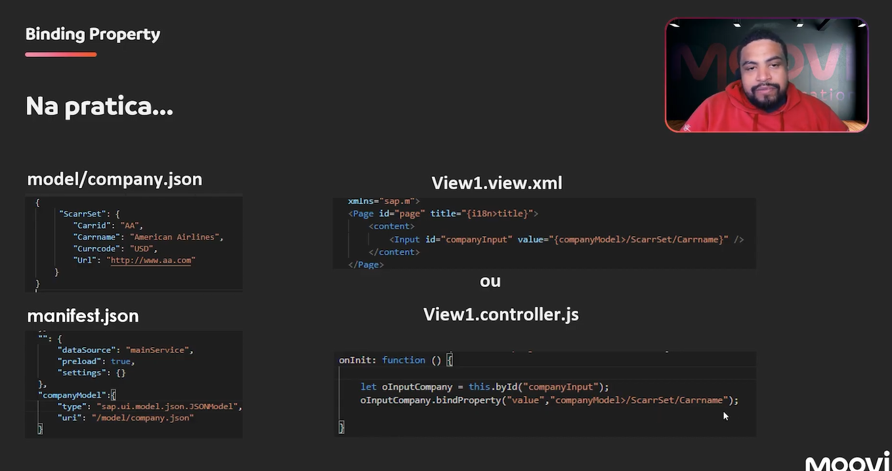

# 📝 SAP UI5 Property Binding: Complete Practical Guide

### **📌 Lesson Overview**
Learn Property Binding in SAP UI5 through hands-on examples using both XML view and JavaScript controller approaches.

---

## 1. 🎯 Project Setup

### **📁 Creating New Application**
1.  **🆕 New Project:** Start from template → **"SAP Fiori Application"**
2.  **🔧 Configuration:**
    - **Application Type:** `Freestyle`
    - **Template:** `SAP Fiori Application` (blank template)
    - **Data Source:** Connect to OData service (for future use)
    - **View Name:** `View1`
    - **Project Name:** `M06-02` (Module 6, Lesson 2)
    - **Namespace:** `move`

### **📋 Generated Structure**
```
webapp/
├── controller/
│   ├── App.controller.js
│   └── View1.controller.js
├── view/
│   └── View1.view.xml
├── model/
│   └── models.js
└── manifest.json
```

---

## 2. 🗃️ Creating JSON Model

### **📄 Step 1: Create JSON File**
1.  **📁 Location:** `webapp/model/company.json`
2.  **📝 Content:** Single SCARR entity (airline data)

```json
{
  "ScarrSet": {
    "Carrid": "AA",
    "Carname": "American Airlines",
    "Currcode": "USD",
    "Url": "http://www.aa.com"
  }
}
```

### **⚙️ Step 2: Configure Model in manifest.json**
```json
"models": {
  "i18n": {
    "type": "sap.ui.model.resource.ResourceModel",
    "uri": "i18n/i18n.properties"
  },
  "": {
    "dataSource": "mainService"
  },
  "companyModel": {
    "type": "sap.ui.model.json.JSONModel",
    "uri": "model/company.json"
  }
}
```


---

## 3. 🔗 Property Binding Methods

### **📋 Two Approaches to Property Binding**

| Method | Location | Use Case |
|--------|----------|----------|
| **XML View Binding** | View1.view.xml | Declarative approach |
| **JavaScript Binding** | View1.controller.js | Programmatic approach |

---

## 4. 🎨 XML View Binding

### **📝 Implementation in View1.view.xml**
```xml
<Page title="Property Binding Demo">
    <content>
        <!-- Method 1: XML View Binding -->
        <Input 
            id="companyInput1" 
            value="{companyModel>/ScarrSet/Carname}" 
        />
    </content>
</Page>
```

### **🔍 XML Binding Syntax**
```xml
{modelName>/path/to/property}
```
- **`companyModel`** - Model name from manifest.json
- **`>/`** - Root path indicator  
- **`ScarrSet/Carname`** - Property path in JSON

---

## 5. ⚡ JavaScript Controller Binding

### **📝 Implementation in View1.controller.js**
```javascript
onInit: function() {
    // Method 2: JavaScript Binding
    var oCompanyInput2 = this.byId("companyInput2");
    oCompanyInput2.bindProperty("value", "companyModel>/ScarrSet/Carname");
}
```

### **🔧 Corresponding XML View**
```xml
<!-- Method 2: JavaScript Binding Target -->
<Input id="companyInput2" />
```

---

## 6. 🏃‍♂️ Running the Application

### **🚀 Execution Steps**
1.  **💻 Terminal:** Run `npm start:no-flp`
2.  **🌐 Browser:** Application opens automatically
3.  **🔐 Authentication:** Enter S/4HANA credentials

### **🎯 Expected Result**
- Two input fields displaying **"American Airlines"**
- Both fields synchronized through the same JSON model

---

## 7. 🔄 Two-Way Binding Demonstration

### **🔄 Live Synchronization**
- **✏️ Edit** either input field
- **🔄 Both fields update automatically**
- **📊 Model updates** in real-time

### **💡 Why This Happens**
- **JSON Model** uses **two-way binding** by default
- **Changes in UI** → **Update model**
- **Changes in model** → **Update all bound UI elements**

---

## 8. 🎯 Key Concepts Explained

### **🏗️ Binding Syntax Comparison**

| Aspect | XML View | JavaScript |
|--------|----------|------------|
| **Syntax** | `{model>/path}` | `bindProperty("property", "model>/path")` |
| **Readability** | ✅ High | 🟡 Medium |
| **Flexibility** | 🟡 Medium | ✅ High |
| **Performance** | ✅ Better | 🟡 Good |

### **🔧 Property Binding Method**
```javascript
// JavaScript bindProperty syntax
control.bindProperty("propertyName", "modelPath");
```
- **`propertyName`**: UI control property to bind (e.g., "value", "text")
- **`modelPath`**: Path to model data (e.g., "companyModel>/ScarrSet/Carname")

---

## 9. ⚠️ Important Notes

### **🔑 Model Naming**
- **Case-sensitive:** Must match manifest.json exactly
- **Namespace:** Use `>` for absolute paths from root
- **Consistency:** Same model name across XML and JavaScript

### **🆔 Element IDs**
- **Unique IDs:** Required for JavaScript binding
- **Naming Convention:** Descriptive names (e.g., "companyInput1")
- **Reference:** Use `this.byId("elementId")` in controllers

### **🔄 Binding Mode**
- **JSON Model:** Defaults to **two-way binding**
- **Behavior:** UI changes update model, model changes update all bound UI elements
- **Persistence:** Changes lost on page refresh (model reloads from JSON file)

---

## 10. ✅ Practical Exercise

### **🎯 Try These Modifications**
1.  **Add third input** using XML binding
2.  **Create new JSON property** and bind to it
3.  **Experiment with different** control properties (text, tooltip, enabled)
4.  **Test one-way binding** with formatter functions

### **🔧 Sample Enhancement**
```xml
<!-- Additional properties binding -->
<Input 
    value="{companyModel>/ScarrSet/Carname}"
    tooltip="{companyModel>/ScarrSet/Carrid}"
    enabled="{= ${companyModel>/ScarrSet/Currcode} === 'USD' }"
/>
```

---

## 11. 🎓 Learning Outcomes

### **📚 Skills Acquired**
- [x] **✅ Create and configure** JSON models
- [x] **✅ Implement property binding** in XML views
- [x] **✅ Implement property binding** via JavaScript
- [x] **✅ Understand two-way binding** behavior
- [x] **✅ Configure models** in manifest.json
- [x] **✅ Debug binding issues**

### **🚀 Next Steps**
- **Aggregation Binding** (for lists and tables)
- **Expression Binding** (for calculations and formatting)
- **Element Binding** (for context switching)

---

### **📋 Summary**
Property Binding connects **UI control properties** with **model data**. You can implement it **declaratively in XML** or **programmatically in JavaScript**. JSON models provide **two-way binding** out of the box, keeping your UI synchronized automatically.

**Ready to move to more advanced binding types!** 🎉

# Typescript

```javascript
import Controller from "sap/ui/core/mvc/Controller";

import Input from "sap/m/Input";

/**
 * @namespace apps.dflc.m06a02.controller
 */
export default class View1 extends Controller {

    /*eslint-disable @typescript-eslint/no-empty-function*/
    public onInit(): void {

        let oCompanyInput2 = this.byId('companyInput2') as Input;

        oCompanyInput2.bindProperty("value", "companyModel>/AirlineSet/AirlineName");

    }
}
```