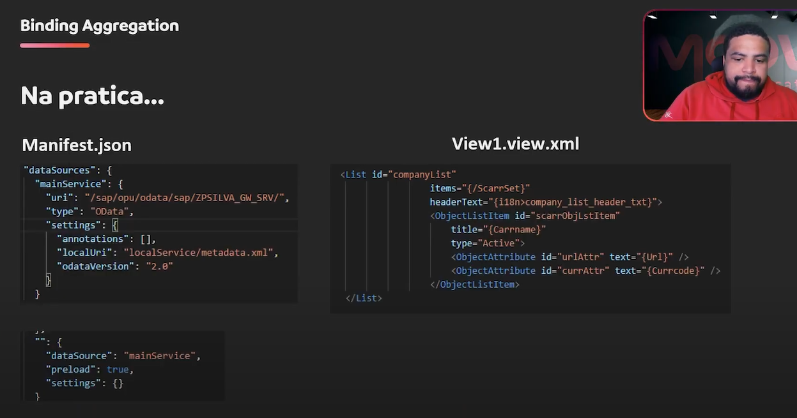

# 📊 SAP UI5 Aggregation Binding: Complete Practical Guide

### **📌 Lesson Overview**
Learn Aggregation Binding in SAP UI5 for displaying lists and collections from OData services, using both XML view and JavaScript controller approaches.

---

## 1. 🎯 Project Setup

### **📁 Creating New Application**
1.  **🆕 New Project:** `M06-04` (Module 6, Lesson 4)
2.  **🔧 Configuration:**
    - **Application Type:** `Freestyle`
    - **Template:** `SAP Fiori Application`
    - **Data Source:** Connect to OData Gateway service
    - **Namespace:** `move`

### **⚙️ Model Configuration**
- **Using OData Model** (not JSON Model like previous lessons)
- **Default model** points to main service from manifest.json
- **i18n model** for translations

---

## 2. 🏗️ Understanding Aggregation Binding

### **📋 What is Aggregation Binding?**
- **🎯 Purpose:** Bind **collections/lists** to UI controls
- **📊 Use Case:** Display lists of data from OData services
- **🔄 Dynamic:** Automatically updates when data changes

### **🔍 Aggregation Binding vs Other Bindings**

| Binding Type | Purpose | Example |
|-------------|---------|---------|
| **Property** | Single values | `{model>property}` |
| **Element** | Container context | `binding="{model>/path}"` |
| **Aggregation** | Lists/collections | `items="{model>/entitySet}"` |

---

## 3. 🎨 XML View Implementation

### **📝 List Control with Aggregation Binding**
```xml
<Page title="Aggregation Binding Demo">
    <content>
        <!-- List with Aggregation Binding -->
        <List
            id="companyList"
            items="{/ScarrSet}"
            headerText="{i18n>company_list_header_txt}">
            
            <!-- Template for each list item -->
            <ObjectListItem
                id="scarObjLstItem"
                title="{Carname}"
                type="Active">
                
                <attributes>
                    <ObjectAttribute
                        id="urlAttr"
                        text="{Url}" />
                    <ObjectAttribute
                        id="currencyAttr" 
                        text="{Currcode}" />
                </attributes>
            </ObjectListItem>
        </List>
    </content>
</Page>
```

### **🔍 Key XML Elements**

#### **List Configuration**
```xml
<List
    id="companyList"
    items="{/ScarrSet}"
    headerText="{i18n>company_list_header_txt}">
```
- **`items="{/ScarrSet}"`** - Aggregation binding to entity set
- **`headerText`** - Bound to i18n translation file
- **No model prefix** - Uses default OData model

#### **List Item Template**
```xml
<ObjectListItem
    title="{Carname}"
    type="Active">
```
- **Relative binding** - No model prefix needed inside aggregation
- **`type="Active"`** - Interactive list item

#### **Item Attributes**
```xml
<ObjectAttribute text="{Url}" />
<ObjectAttribute text="{Currcode}" />
```
- **Child elements** of ObjectListItem
- **Display additional data** for each item

---

## 4. 🌐 i18n Configuration

### **📄 Translation File Setup**
```properties
# i18n/i18n.properties
appTitle=Aggregation Binding
appDescription=Your application description
company_list_header_txt=Airlines
```

### **⚙️ manifest.json i18n Model**
```json
"models": {
    "i18n": {
        "type": "sap.ui.model.resource.ResourceModel",
        "uri": "i18n/i18n.properties"
    },
    "": {
        "dataSource": "mainService"
    }
}
```

---

## 5. ⚡ JavaScript Controller Implementation

### **📝 Programmatic Aggregation Binding**
```xml
<!-- Simplified XML View -->
<List
    id="companyList"
    headerText="{i18n>company_list_header_txt}">
    <!-- No items binding in XML - done in controller -->
</List>
```

### **🔧 Controller Implementation**
```javascript
onInit: function() {
    // Get list control
    var oList = this.byId("companyList");
    
    // Create list item template
    var oUIControl = new sap.m.ObjectListItem({
        title: "{Carname}",
        type: "Active"
    });
    
    // Add attributes to list item
    oUIControl.addAttribute(new sap.m.ObjectAttribute({
        text: "{Url}"
    }));
    
    oUIControl.addAttribute(new sap.m.ObjectAttribute({
        text: "{Currcode}"
    }));
    
    // Bind aggregation to list
    oList.bindAggregation("items", "/ScarrSet", oUIControl);
}
```

### **🔄 bindAggregation() Method**
```javascript
control.bindAggregation("aggregationName", "modelPath", template);
```
- **`aggregationName`** - Name of aggregation property (e.g., "items")
- **`modelPath`** - Path to entity set (e.g., "/ScarrSet") 
- **`template`** - Control template for each item

---

## 6. 🔍 Binding Path Syntax

### **📍 Default Model Binding**
```xml
<!-- No model name needed for default model -->
<List items="{/ScarrSet}">
    <ObjectListItem title="{Carname}" />
</List>
```

### **📍 Named Model Binding**
```xml
<!-- With model name prefix -->
<List items="{companyModel>/ScarrSet}">
    <ObjectListItem title="{companyModel>Carname}" />
</List>
```

### **📍 Relative vs Absolute Paths**
```xml
<!-- Inside aggregation - relative paths -->
<List items="{/ScarrSet}">
    <ObjectListItem title="{Carname}" />          <!-- Relative -->
    <ObjectListItem title="{/ScarrSet/Carname}" /> <!-- Absolute -->
</List>
```

---

## 7. 🏃‍♂️ Running the Application

### **🚀 Execution Steps**
1.  **💻 Terminal:** `npm start:no-flp`
2.  **🔐 Authentication:** Enter S/4HANA credentials
3.  **📊 Result:** List displays airlines from OData service

### **🎯 Expected Behavior**
- **List header** shows "Airlines" from i18n file
- **Each list item** shows airline name as title
- **Item attributes** show URL and currency code
- **Data loaded** from OData service after authentication

---

## 8. ⚡ Advanced Aggregation Features

### **🔄 Dynamic Template Selection**
```javascript
// Different templates based on data
oList.bindAggregation("items", "/ScarrSet", 
    function(sId, oContext) {
        var sCarrid = oContext.getProperty("Carrid");
        
        if (sCarrid === "AA") {
            return new sap.m.StandardListItem({title: "{Carname}"});
        } else {
            return new sap.m.ObjectListItem({title: "{Carname}"});
        }
    }
);
```

### **🎯 Filtering and Sorting**
```xml
<List 
    items="{
        path: '/ScarrSet',
        filters: [
            {path: 'Currcode', operator: 'EQ', value1: 'USD'}
        ],
        sorter: {path: 'Carname', descending: false}
    }">
</List>
```

---

## 9. 🎯 When to Use Each Approach

### **📋 XML vs JavaScript Aggregation Binding**

| Scenario | Recommended Approach |
|----------|---------------------|
| **Static lists** | ✅ XML Aggregation Binding |
| **Dynamic templates** | ✅ JavaScript Aggregation Binding |
| **Simple data display** | ✅ XML Aggregation Binding |
| **Complex business logic** | ✅ JavaScript Aggregation Binding |
| **Performance critical** | ✅ XML Aggregation Binding |

### **💡 XML Advantages**
- **✨ Declarative** - easier to read and maintain
- **⚡ Better performance** - compiled during view instantiation
- **🔧 Less code** - more concise

### **💡 JavaScript Advantages**  
- **🔄 Dynamic** - change templates at runtime
- **🎯 Conditional** - different templates based on data
- **🔧 Complex logic** - handle complex business rules

---

## 10. 🐛 Debugging Tips

### **🔍 Common Issues & Solutions**
```javascript
// Check if binding is working
console.log(oList.getBinding("items")); 

// Verify model data
console.log(this.getView().getModel().getData());

// Check aggregation items
console.log(oList.getItems().length);
```

### **✅ Validation Checklist**
- [ ] **✅ Model configured** in manifest.json
- [ ] **✅ Correct entity set** path in binding
- [ ] **✅ i18n properties** defined and referenced correctly
- [ ] **✅ Template controls** properly configured
- [ ] **✅ Authentication** provided for OData service

---

## 11. 🎓 Learning Outcomes

### **📚 Skills Acquired**
- [x] **✅ Understand** Aggregation Binding concept
- [x] **✅ Implement** XML-based aggregation binding
- [x] **✅ Implement** JavaScript-based aggregation binding  
- [x] **✅ Configure** i18n for multilingual support
- [x] **✅ Choose appropriate** binding approach
- [x] **✅ Debug** aggregation binding issues

### **🚀 Real-World Applications**
- **Employee lists** from HR system
- **Product catalogs** from material master
- **Customer lists** from business partners
- **Order lists** from sales documents
- **Any tabular data** from OData services

---

## 12. 🔧 Best Practices

### **💡 XML Aggregation Binding**
```xml
<!-- GOOD: Clean, declarative -->
<List items="{/EntitySet}">
    <StandardListItem title="{Property}" />
</List>

<!-- AVOID: Complex logic in XML -->
<List items="{path: '/EntitySet', filters: [/*complex filter*/]}">
    <!-- Complex template -->
</List>
```

### **💡 JavaScript Aggregation Binding**
```javascript
// GOOD: Dynamic template selection
oList.bindAggregation("items", "/EntitySet", this._createTemplate.bind(this));

// AVOID: Hard-to-maintain inline templates
oList.bindAggregation("items", "/EntitySet", new sap.m.ObjectListItem({
    /* complex configuration */
}));
```

---

### **📋 Summary**
Aggregation Binding is **essential for displaying lists** in SAP UI5 applications. Use **XML approach for static lists** and **JavaScript approach for dynamic scenarios**. Both methods connect to OData services efficiently and provide excellent user experiences.

**Key takeaways:**
- Use **relative binding paths** inside aggregations
- **Leverage i18n** for multilingual support
- **Choose the right approach** based on complexity
- **Test with real OData services** for authentication flows

**Ready for Expression Binding next!** 🎉